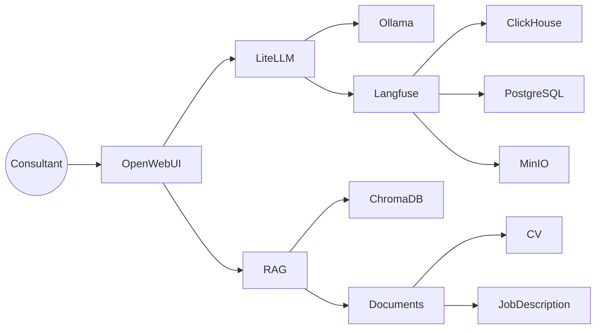
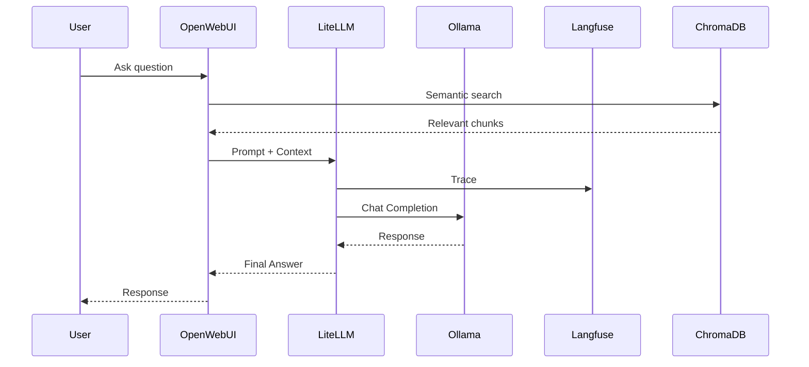
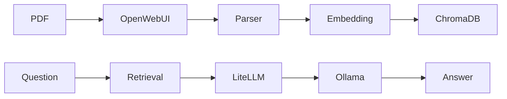

# Architecture Overview

> Thiga AI Technical Assessment
>
> Senior Solution Architect — Alban Andrieu

---

# Objective

Design a sovereign AI platform enabling consultants to interact with enterprise knowledge while maintaining complete control over:

- data
- models
- observability
- security
- future integrations

The architecture is intentionally modular to allow independent evolution of every component.

---

# Architecture Principles

The solution follows five architectural principles.

| Principle | Implementation |
|------------|----------------|
| Sovereignty | Local LLM inference using Ollama |
| Loose Coupling | LiteLLM gateway |
| Observability | Langfuse tracing |
| Knowledge Retrieval | Open WebUI RAG |
| Future Extensibility | MCP-ready architecture |

---

# High-Level Architecture



---

# Component Responsibilities

| Component | Responsibility |
|------------|---------------|
| Open WebUI | User interface, assistant management, RAG orchestration |
| LiteLLM | LLM gateway, routing, authentication, tracing |
| Ollama | Local model inference |
| Langfuse | Observability, traces, prompts, sessions |
| ChromaDB | Vector database |
| PostgreSQL | Metadata |
| ClickHouse | Analytics |
| MinIO | Object storage |
| Docker Compose | Deployment |

---

# End-to-End Flow



---

# Internal Network

```text
                 Docker Network

+------------------------------------------------------+

 Open WebUI          :31028

 LiteLLM             :4000

 Ollama              :11434

 Langfuse Web        :3000

 Langfuse Worker

 PostgreSQL          :5432

 ClickHouse          :8123 / 9000

 Redis               :6379

 MinIO               :9001 (UI)
                      9002 (API)

 ChromaDB (embedded)

+------------------------------------------------------+
```

Only Open WebUI is intended to be exposed to end users.

All other services remain on the internal Docker network.

---

# Data Flow



---

# Why this Architecture?

The architecture prioritises **modularity**.

Rather than connecting Open WebUI directly to Ollama, LiteLLM was introduced to provide:

- provider abstraction
- OpenAI-compatible API
- tracing integration
- routing
- future multi-model support

This enables replacing Ollama with another inference backend without modifying Open WebUI.

---

# Business Justification

This architecture addresses several business objectives.

## Reduce Vendor Lock-in

The organisation remains independent from any AI provider.

Changing from:

- Ollama
- OpenAI
- Anthropic
- Azure OpenAI
- vLLM

requires only a LiteLLM configuration update.

---

## Accelerate AI Adoption

The stack provides:

- conversational interface
- document search
- prompt management
- observability

without requiring application modifications.

---

## Improve Maintainability

Each service has a single responsibility.

Services can evolve independently.

---

# Sovereignty

The proposed architecture satisfies the sovereignty constraint.

## Models

Inference is executed locally through Ollama.

No prompts are sent to external providers.

## Documents

Enterprise documents remain inside the infrastructure.

Vector embeddings are stored locally.

## Traces

Observability data remains inside Langfuse.

## Authentication

JWT authentication remains local.

No external identity provider is required for this PoC.

---

# Security Considerations

Implemented

- Internal Docker network
- JWT authentication
- LiteLLM authentication
- User identity propagation
- Local inference
- Private vector database

Future improvements

- OAuth2 / OIDC
- RBAC
- Secret Manager
- Vault
- Kubernetes Network Policies
- TLS everywhere

---

# Risks and Limitations

| Risk | Mitigation |
|------|------------|
| Small local GPU | Allow external providers through LiteLLM |
| Single-host deployment | Kubernetes in production |
| Limited RAG evaluation | Langfuse automatic evaluations |
| Prompt quality | Prompt versioning |
| No MCP | Planned second iteration |

---

# Future Evolution

```mermaid
flowchart LR

Current

OpenWebUI --> LiteLLM
LiteLLM --> Ollama

Future

OpenWebUI --> LiteLLM

LiteLLM --> Ollama
LiteLLM --> OpenAI
LiteLLM --> Claude
LiteLLM --> vLLM

OpenWebUI --> MCP

MCP --> Jira

MCP --> GitLab

MCP --> Calendar

MCP --> Internal APIs
```
