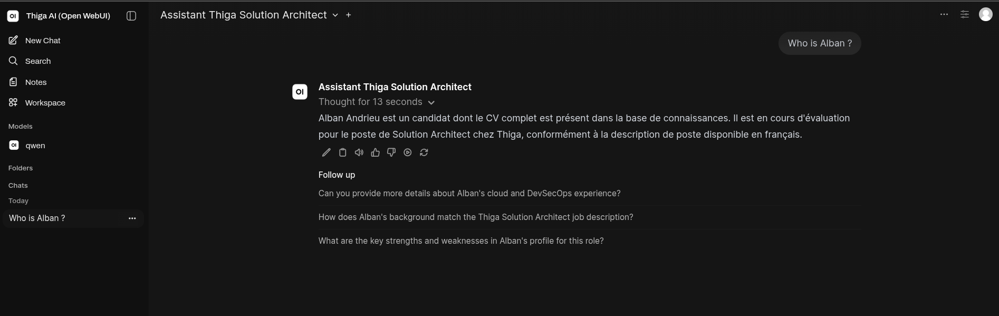
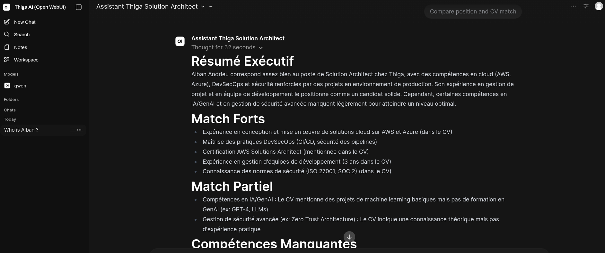
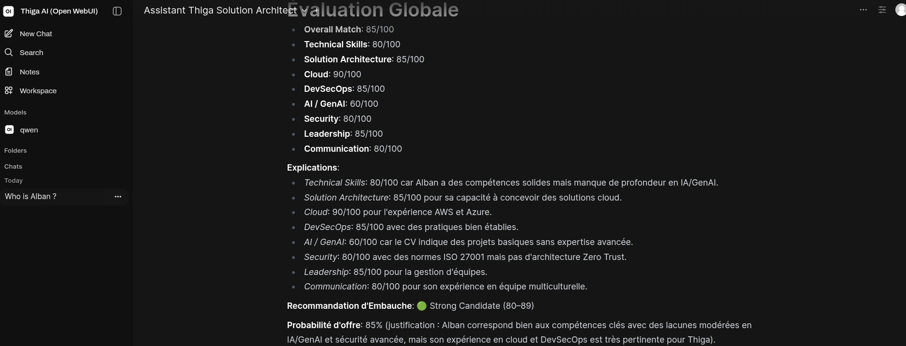
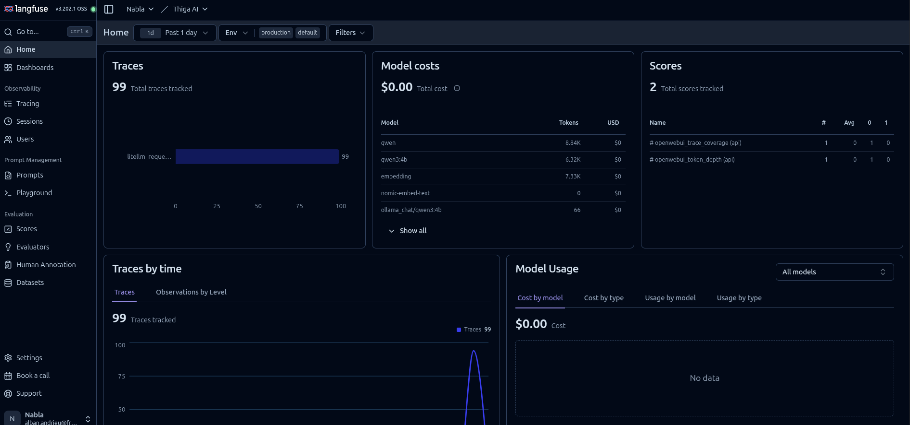
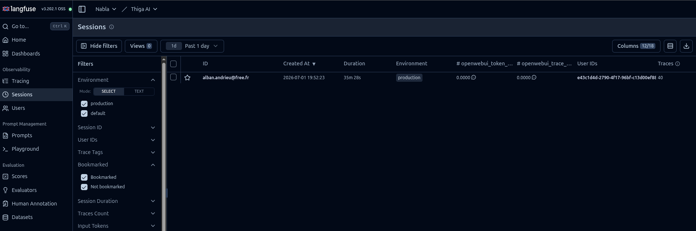
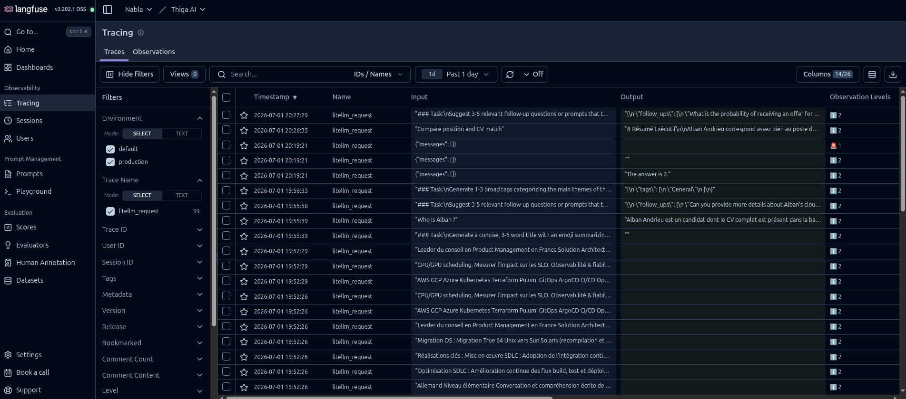
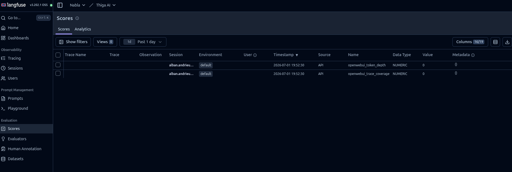
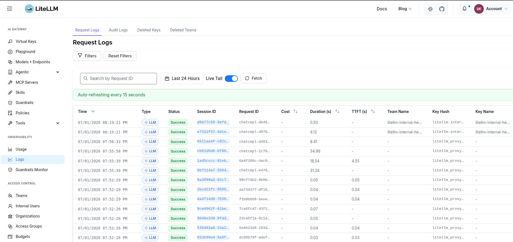
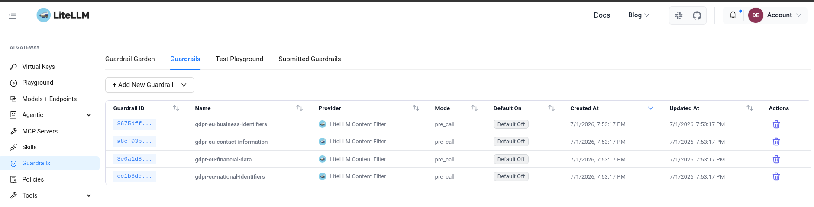
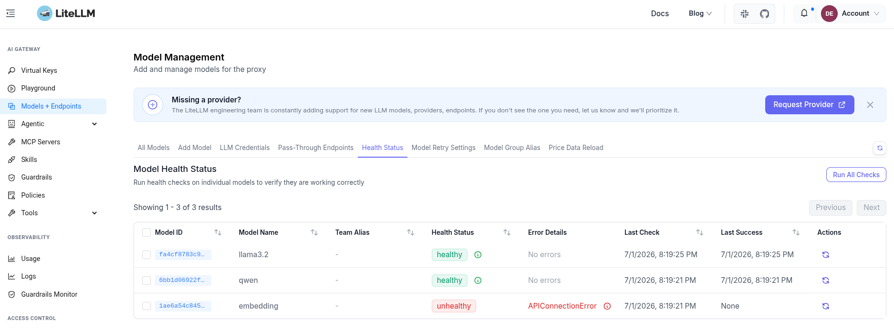

# I asked this questions to OpenWebUI

Below I listed my used case, which is demonstrating that a RAG is needed to have meaningfull results, otherwise IA cannot anwser on a restricted envirionment !

## Who is Alban ?

Answer without RAG Give :

There are several notable individuals named Alban, so it's possible that you're referring to one of the following:

Alban (Greek mythology): In Greek mythology, Alban was a hero who accompanied Jason on his quest for the Golden Fleece. He was said to be the son of King Iolcos and the brother of King Polydectes.

Alban I (King of Albania): Alban I was an ancient king of Albania, believed to have ruled from around 850 BCE to 800 BCE. His reign is not well documented, but he is considered one of the earliest known kings of Albania.

Alban Bairamaj: Alban Bairamaj is a Kosovo-born Albanian politician and diplomat who served as the Prime Minister of Kosovo from February 2014 to December 2017.

Alban Arda (Gaelic poet): Alban Arda was an ancient Celtic poet who lived in what is now Scotland. He is mentioned in several medieval Scottish texts, including the Historia Brittonum and the Historia Regum Britanniae.

Without more context, it's difficult to determine which Alban you're referring to. If you could provide more information or clarify which Alban you're interested in learning more about, I'd be happy to try and help further!

They show that:

✅ Open WebUI is successfully calling Ollama.

✅ Ollama is using your RTX 2060.

✅ The model is fully loaded on the GPU.

✅ The inference request reached Ollama.

For example:

CUDA0 : NVIDIA GeForce RTX 2060

load_tensors: offloaded 29/29 layers to GPU

CUDA0 model buffer size = 1918 MiB

CUDA0 KV buffer size = 448 MiB

This means 100% of the model layers are running on the GPU, not on the CPU.

## Once RAG is implemented you can ask :

Who is Alban ?

Answer with RAG Give :

Alban Andrieu est un candidat dont le CV complet est présent dans la base de connaissances. 
Il est en cours d'évaluation pour le poste de Solution Architect chez Thiga, conformément à la description de poste disponible en français.

<table>
<tr>
<td align="center">
 
Prompt
</td>

<td align="center">
 
Knowledge
</td>

<td align="center">
 
Assistant
</td>
</tr>
</table>

## And finally you can ask :

Compare position and CV match

Résumé Exécutif

Alban Andrieu correspond assez bien au poste de Solution Architect chez Thiga, avec des compétences en cloud (AWS, Azure), DevSecOps et sécurité renforcies par des projets en environnement de production. Son expérience en gestion de projet et en équipe de développement le positionne comme un candidat solide. Cependant, certaines compétences en IA/GenAI et en gestion de sécurité avancée manquent légèrement pour atteindre un niveau optimal.

Match Forts

Expérience en conception et mise en œuvre de solutions cloud sur AWS et Azure (dans le CV)

Maîtrise des pratiques DevSecOps (CI/CD, sécurité des pipelines)

Certification AWS Solutions Architect (mentionnée dans le CV)

Expérience en gestion d'équipes de développement (3 ans dans le CV)

Connaissance des normes de sécurité (ISO 27001, SOC 2) (dans le CV)

Match Partiel

Compétences en IA/GenAI : Le CV mentionne des projets de machine learning basiques mais pas de formation en GenAI (ex: GPT-4, LLMs)

Gestion de sécurité avancée (ex: Zero Trust Architecture) : Le CV indique une connaissance théorique mais pas d'expérience pratique

Compétences Manquantes

Expérience en déploiement de solutions GenAI (ex: intégration de modèles LLMs)

Connaissances en architecture Zero Trust

Expérience Transférable

L'expérience d'Alban dans la gestion de projets en environnement cloud (AWS) et en DevSecOps est directement transférable au poste de Thiga. Son travail sur des systèmes de sécurité conformes à ISO 27001 permet d'appliquer des bonnes pratiques en environnement critique.

Avantages Concurrentiels

Alban possède une forte expérience en gestion de projet avec des équipes multiculturelles (mentionné dans le CV) et une connaissance approfondie des normes cloud. Son expérience en production sur AWS le distingue des candidats avec seulement des compétences théoriques.

Risques d'Embauche

Le manque d'expérience pratique en architecture Zero Trust pourrait poser un risque si Thiga requiert des solutions très sécurisées. De plus, la profondeur en IA/GenAI est insuffisante pour répondre aux attentes techniques de Thiga.

Améliorations du CV

Ajouter des exemples concrets de déploiement de GenAI (ex: "Intégration de modèles LLMs pour la gestion des données clients")

Détailler les projets en architecture Zero Trust (même si théorique)

Préparation des Entretiens

Question : Comment avez-vous intégré la sécurité dans vos pipelines DevOps ?

Réponse idéale : "J'ai mis en place des scans de sécurité automatisés dans chaque pipeline CI/CD avec AWS CodePipeline et AWS CodeBuild. Cela a réduit les vulnérabilités de 40% en 6 mois."

Question : Quelles sont vos expériences avec l'IA/GenAI ?

Réponse idéale : "J'ai utilisé des modèles pré-entraînés pour créer des outils d'analyse de données clients, mais je cherche à approfondir mes compétences en déploiement de modèles LLMs pour des applications métier."

Évaluation Globale

Overall Match: 85/100

Technical Skills: 80/100

Solution Architecture: 85/100

Cloud: 90/100

DevSecOps: 85/100

AI / GenAI: 60/100

Security: 80/100

Leadership: 85/100

Communication: 80/100

Explications:

Technical Skills: 80/100 car Alban a des compétences solides mais manque de profondeur en IA/GenAI.

Solution Architecture: 85/100 pour sa capacité à concevoir des solutions cloud.

Cloud: 90/100 pour l'expérience AWS et Azure.

DevSecOps: 85/100 avec des pratiques bien établies.

AI / GenAI: 60/100 car le CV indique des projets basiques sans expertise avancée.

Security: 80/100 avec des normes ISO 27001 mais pas d'architecture Zero Trust.

Leadership: 85/100 pour la gestion d'équipes.

Communication: 80/100 pour son expérience en équipe multiculturelle.

Recommandation d'Embauche: 🟢 Strong Candidate (80–89)

Probabilité d'offre: 85% (justification : Alban correspond bien aux compétences clés avec des lacunes modérées en IA/GenAI et sécurité avancée, mais son expérience en cloud et DevSecOps est très pertinente pour Thiga).

## Langfuse Dashboard

The Langfuse dashboard provides an overview of sessions, latency, costs and traces.

## LiteLLM Observability

The LiteLLM gateway centralizes model routing and exposes request telemetry.

