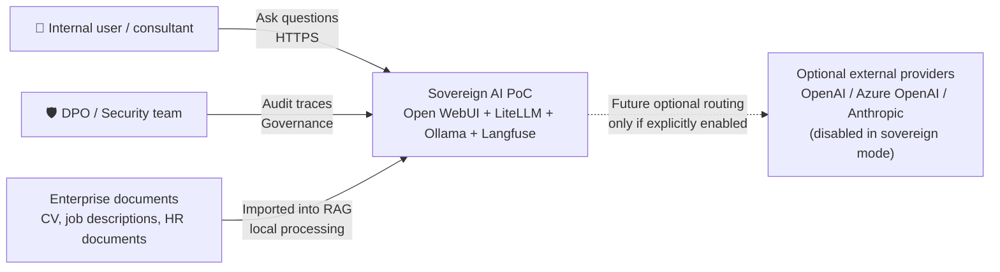
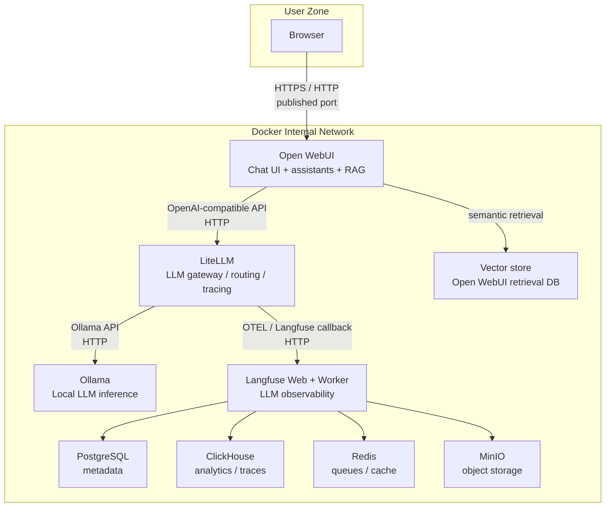
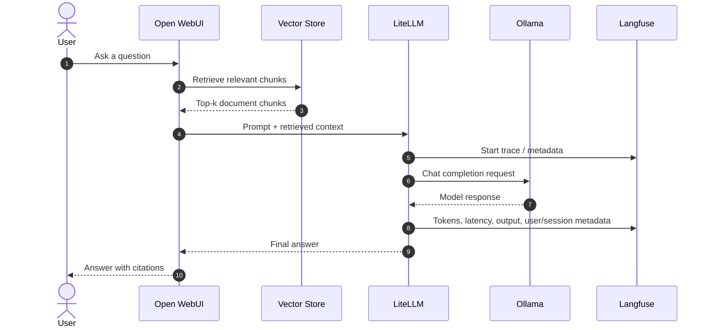
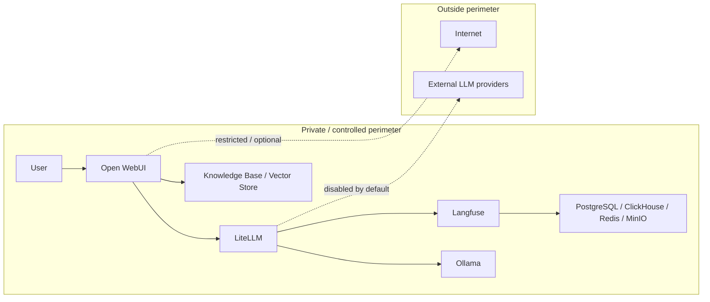
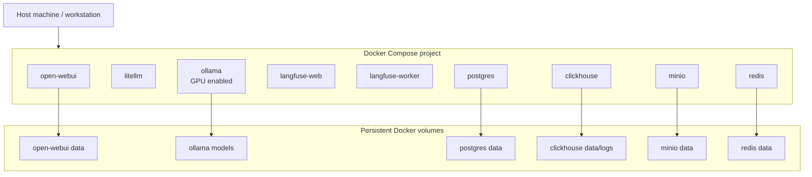
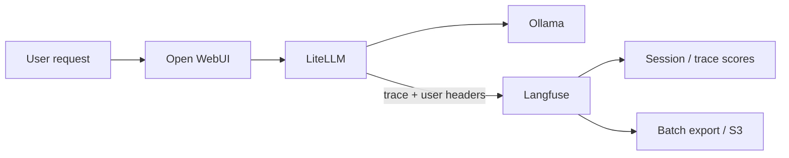
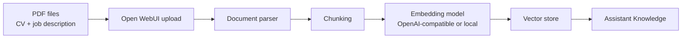
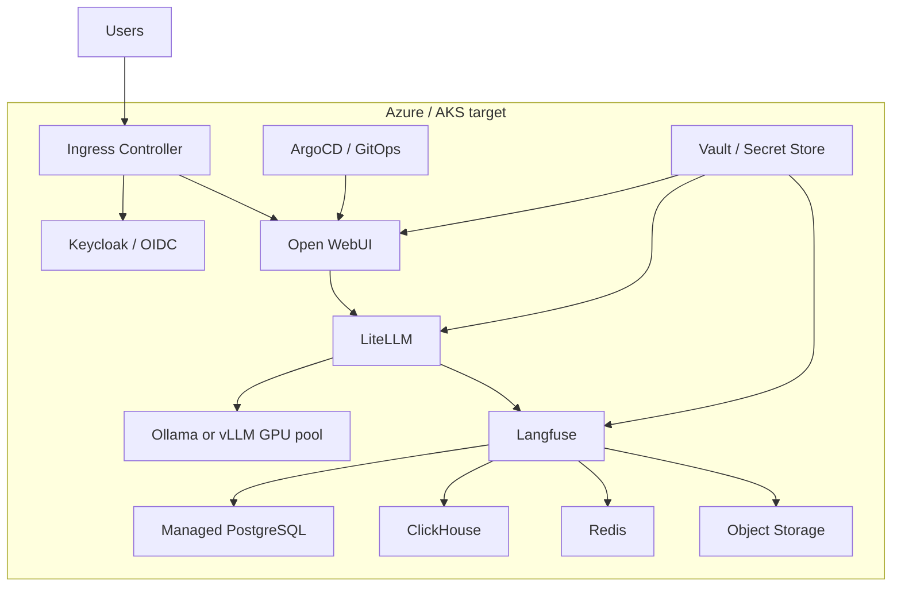

# Diagrams

> Mermaid diagrams for the AI Technical Assessment.
>
> These diagrams are intentionally simple and presentation-oriented.

---

## 1. C4 — System Context

---

## 2. C4 — Container Diagram

---

## 3. Request Sequence — RAG Answer

---

## 4. Data Sovereignty Boundary

---

## 5. Deployment View — Docker Compose

---

## 6. Observability Flow

---

## 7. RAG Ingestion Flow

---

## 8. Future AKS Target Architecture

