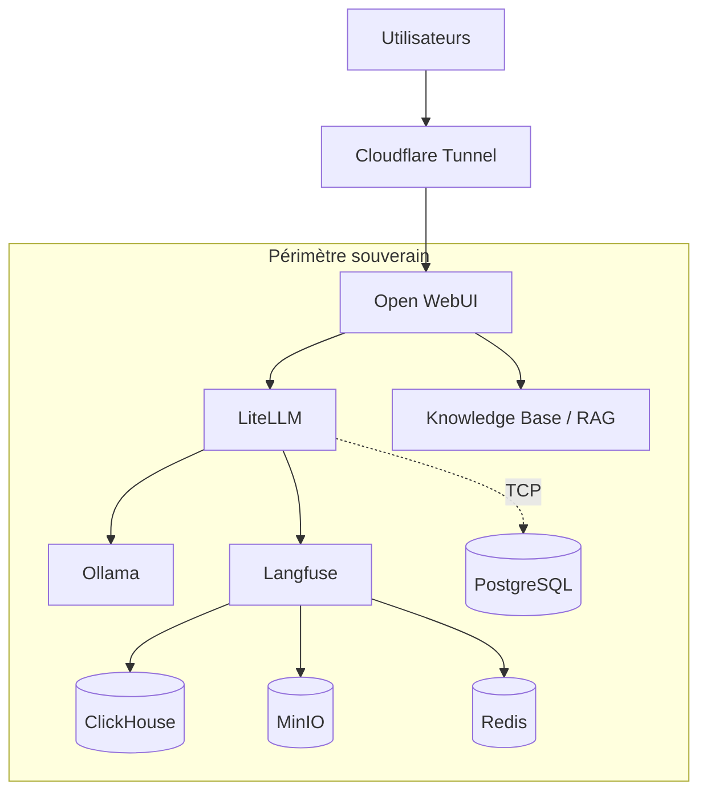

# 2. Vue d'architecture

## Composants clés

<h2>🌐 User Experience</h2>
Open WebUI • Cloudflare Access

<h2>🧠 AI Platform</h2>
LiteLLM • Ollama • RAG • Prompt Templates

<h2>📊 Observability</h2>
Langfuse • Tracing • Scores • Sessions

<h2>🗄 Infrastructure</h2>
PostgreSQL • ClickHouse • Redis • MinIO

Cloudflare est volontairement placé hors périmètre souverain ; les traitements IA et les données restent internes.

<!--
Je distingue le périmètre non souverain, limité à Cloudflare, du périmètre souverain où se trouvent les données, les modèles, les traces et les bases. Le flux principal est utilisateur vers Open WebUI, puis LiteLLM vers Ollama et Langfuse.
-->
