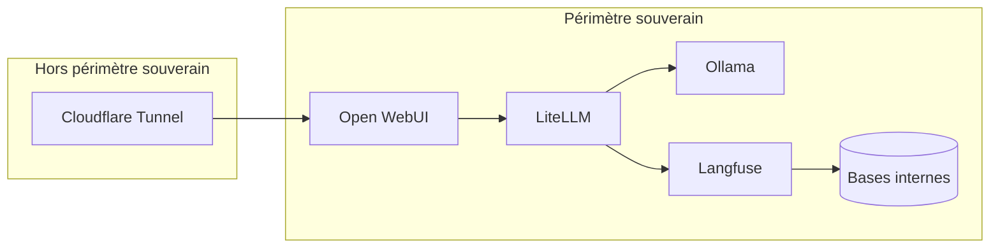

# 3. Réponse à la contrainte de souveraineté

## Ce qui reste interne

- Prompts
- Documents
- Embeddings
- Réponses
- Traces / Sessions / Scores
- Modèles locaux

## Ce qui sort

- Accès HTTPS via Cloudflare uniquement
- Pas d'appel LLM externe en mode souverain
- Pas d'exposition directe d'Ollama
- Pas d'exposition directe des bases

<!--
La souveraineté vient principalement de l'inférence locale avec Ollama, du stockage interne des documents et des traces, et du fait que LiteLLM peut bloquer ou contrôler tout routage externe.
-->
