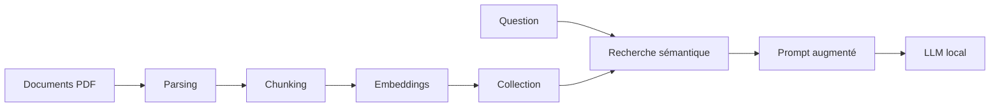

# 4. RAG et assistants métier

## Démonstration POC

- CV candidat
- Fiche de poste Thiga
- Assistant spécialisé
- Analyse d'adéquation
- Score final
- Citations documentaires

  
  
  

<!--
Le RAG permet d'ancrer les réponses dans des documents contrôlés. Dans le POC, j'ai automatisé la création d'une Knowledge Base et d'un assistant dédié au matching CV / fiche de poste.
-->
