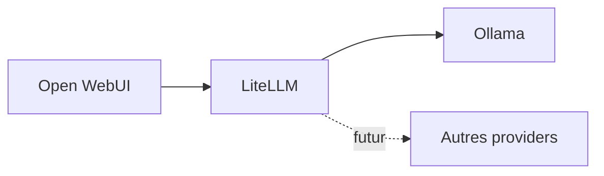

# 5. Pourquoi LiteLLM ?

## Décision

Ne pas coupler directement Open WebUI à Ollama.

## Raisons

- Je connaissais déjà LiteLLM
- Validation d'Ollama avant Open WebUI
- Découplage UI / modèles
- API OpenAI compatible
- Routage et fallbacks
- Observabilité Langfuse
- Base pour guardrails
- Préparation multi-modèles

MCP n'a pas été intégré dans le POC par contrainte de temps. J'ai cependant déjà une base MCP presque prête : gitlab.com/AlbanAndrieu/fastapi-sample.

<!--
LiteLLM est un choix pragmatique. Il ajoute un composant, mais il réduit fortement la complexité de débogage et prépare l'évolution vers d'autres modèles ou providers.
-->
