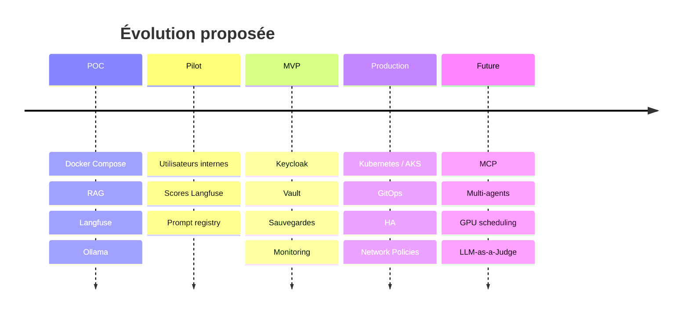

# 9. Roadmap vers une plateforme d'entreprise

<strong>Court terme</strong> 
Stabiliser, documenter, scorer.

<strong>Moyen terme</strong> 
SSO, Vault, monitoring.

<strong>Long terme</strong> 
AKS, GitOps, multi-tenancy.

<!--
La roadmap traduit le POC en trajectoire crédible. Elle montre comment passer d'une démonstration locale à une plateforme d'entreprise.
-->
